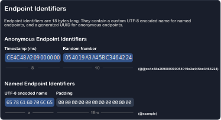
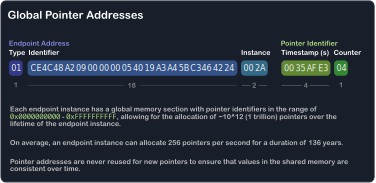

# Important DATEX Concepts

In this section, we will give you a quick introduction to DATEX.

DATEX is a communication protocol and language developed by unyt.org.
It provides realtime data exchange and synchronization for distributed applications.

The DATEX Script Language (DATEX Script or DX) is a human-readable representation of DATEX.
You can [write and execute DATEX Script code](./5%20The%20DATEX%20API.md#the-datex-template-function) directly in the browser with the DATEX runtime included in the DATEX JS library.


> If you want to dive deeper, check out the [DATEX Language Specification](https://github.com/unyt-org/datex-specification).
> You can also write and test DATEX Script code in the [DATEX Playground](https://playground.unyt.org/).

### Endpoints

An *endpoint* in the DATEX world is an entity that is participating in the network. 
Endpoints can be associated with people or institutions, but they can also be completely anonymous.

Each endpoint can connect multiple *endpoint instances* to the network simulataneously.
Endpoints communicate via DATEX, either with relays or over direct connections.

Endpoint identifiers always start with an '@' symbol and contain alphanumeric characters or a hex id in
the case of anonymous endpoints.



Endpoints can create pointers, expose public properties, handle permissions for pointers and much more.

The following example demonstrates how the result of an remotely called endpoint function can be received:

```datex
ref hello = @example.helloWorld(); // execute 'helloWorld' on example and save the value in the 'hello' variable
```

You can read more about this in the chapters [Endpoints](./05%20Endpoints.md) and [Endpoint Configuration](./06%20Endpoint%20Configuration.md).
You can also find more details in the [DATEX Specification](https://github.com/unyt-org/datex-specification).


### References and Pointers

In DATEX, every value can be bound to a reference.
A reference can be either a local reference or a global reference (*pointer*).

Pointers can be accessed and modified across the network from multiple endpoints at once.
The creator of a pointer can configure read and write permissions for other enpoints.

Pointers can also be transformed into new pointers. A transformed pointer is always updated to
hold the value defined by a *transform function*.

In DATEX, every value (including primitives) can be assigned to a pointer.

```datex
ref a = 5; // create a new pointer with the value '5'
ref b = 0; // create a new pointer with the value '0'
ref sum = always a + b; // create a pointer with the computed value of 'a + b'

b = 5; 	   // update the value of the pointer 'b'
print sum; // the pointer 'sum' now has the value '10'
```


