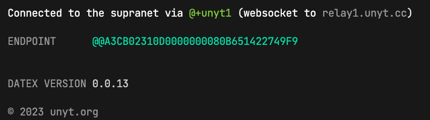

# Pointer Synchronisation

Every DATEX pointer can be shared and synchronized between multiple endpoints.

This chapter serves as an introduction to shared pointers and explains the concepts behind pointer synchronisation.

<p></p><br>

## Shared memory in the Supranet

The Supranet can be regarded as one continuously running global process that has access to a *shared memory*.
Endpoints within the Supranet are running separate *threads* within this global process. 
They all have (limited) access to the data within the shared memory.

Every DATEX pointer that is created on an endpoint becomes part of this globally shared memory.
This does not mean that pointers are automatically sent to other endpoints when they are created, but they
can always be accessed by other endpoints when needed (as long as the endpoint has the required permissions to access the pointer).


## Learn by example: Pointer synchronisation between two clients

### Setup

For this demonstration, you need two separate browser clients with a developer console.
Alternatively, you can start a Deno CLI process by running the `deno` command.

To initialize the endpoints, first import the DATEX runtime:
```ts
await import("https://cdn.unyt.org/datex-core-js-legacy/datex.js")
```

Now, you can connect to the supranet:
```ts
await Datex.Supranet.connect()
```
After a successful initialization, you should see the connection info printed to the console:




> [!NOTE] 
> You can learn more about supranet connections in the chapter [Supranet Networking](./06%20Supranet%20Networking.md).

### Creating a pointer

As explained in the chapter [Pointers](./03%20Pointers.md),
you can now create a new pointer containing a number value.

```ts
const x = $(42)
x.val // -> 42
```

### Pointer IDs

Each DATEX pointer has a globally unique address (*pointer id*) that
is linked to an endpoint.
With this id, a pointer can be found in the supranet.

The pointer id can be accessed via the `id` property of a pointer instance:

```ts
x.id // -> e.g. "D5A3CB02310Dx480B651422749F9x40C85600300"
```

## Pointer Protection

Per default, pointers have read/write restrictions and can only be accessed by the endpoint that created them or other
instances of the same endpoint.

You can explicitly grant access for a pointer to a specific endpoint:

```ts
const y = $(43);
grantAccess(y, '@user1'); // @user1 can now read/write x
revokeAccess(y, '@user1'); // @user1 can no longer read/write x
```

You can also make a pointer publicly accessible by all endpoints, which
we will do for our example pointer `x`:
```ts
grantPublicAccess(x); // any endpoint can now read/write x
```

> [!NOTE]
> To allow all remote endpoints to access pointers that are created on the local endpoint, you can disable the runtime option `PROTECT_POINTERS`:
> ```ts
> Datex.Runtime.OPTIONS.PROTECT_POINTERS = false
> ```
> We want to emphasize that this is a major security risk and should only be used in controlled environments and for testing purposes.

### Accessing remote pointers

Now that we know the id of the pointer `x` and have made it publicly accessible,
we can access it from another endpoint:

Open a new browser tab or Deno CLI and follow the same steps
to load the DATEX runtime and connect to the supranet:
```ts
await import("https://cdn.unyt.org/datex-core-js-legacy/datex.js")
await Datex.Supranet.connect()
```

You can use the `$` shortcut to load the remote pointer with the previously determined id, e.g.:

```ts
const x = await $.D5A3CB02310Dx480B651422749F9x40C85600300
```

The variable `x` now holds a reference to the same pointer that we
created on the other client before.

You can verify this by reading the pointer value:
```ts
x.val // -> 42
```

### Synchronisation

The pointer that we stored in the variable `x` is not just a static value - its value is updated bidirectionally.

That means that any changes on the original endpoint are reflected
on the second endpoint, and vice-versa - try it out for yourself:

**Update value on first client:**
```ts
x.val = 10
```

**Read value on second client:**
```ts
x.val // -> 10
```

Pointer synchronisation does not just work with primitive values,
but also with objects, maps, sets, etc.


## Global Garbage Collection (GGC)

DATEX has a global garbage collection mechanism that handles shared pointers across the network.

Global garbage collection works with both primitive and complex pointers.

### Garbage collection rules

1. If a pointer was loaded from a *remote* endpoint, it is garbage collected if there are no local references to the pointer

2. If a pointer was created by the *local* endpoint, it is only garbage collected if the following conditions are fulfilled:
   * There are no local references to the pointer
   * There are no references to the pointer on other endpoints


## Unique Pointers

The DATEX JS Runtime guarantees that two pointers with the same
id are always pointing to the same instance:

```ts
const x1 = await $.ABCDEF
const x2 = await $.ABCDEF
assert (x1 === x2)
```

The identity of a pointer is always preserved. Even if you receive the pointer
from a remote endpoint call, it is still identical to the local instance:

```ts
// remote endpoint

type User = {name: string, age: number}

const happyBirthday = $(
   function (user: User) {
      user.age++;
      return user;
   }
)
```

```ts
// local endpoint

const user = $({
   name: "Luke",
   age: 20
})

const happyBirthday = await $.DEFABCDEF // <- pointer id for the remote "happyBirthday" function
const olderUser = await happyBirthday(user);

user === olderUser // true
olderUser.age === 21 // true
user.age === 21 // true
```

Like we would expect if this was a normal, local JavaScript function call, the returned
`user` object is identical to the object we passed to the function.
This is not only true for this simple example, but also for more complex scenarios.
For example, reference identities are also preserved within [eternal values](./05%20Eternal%20Pointers.md).