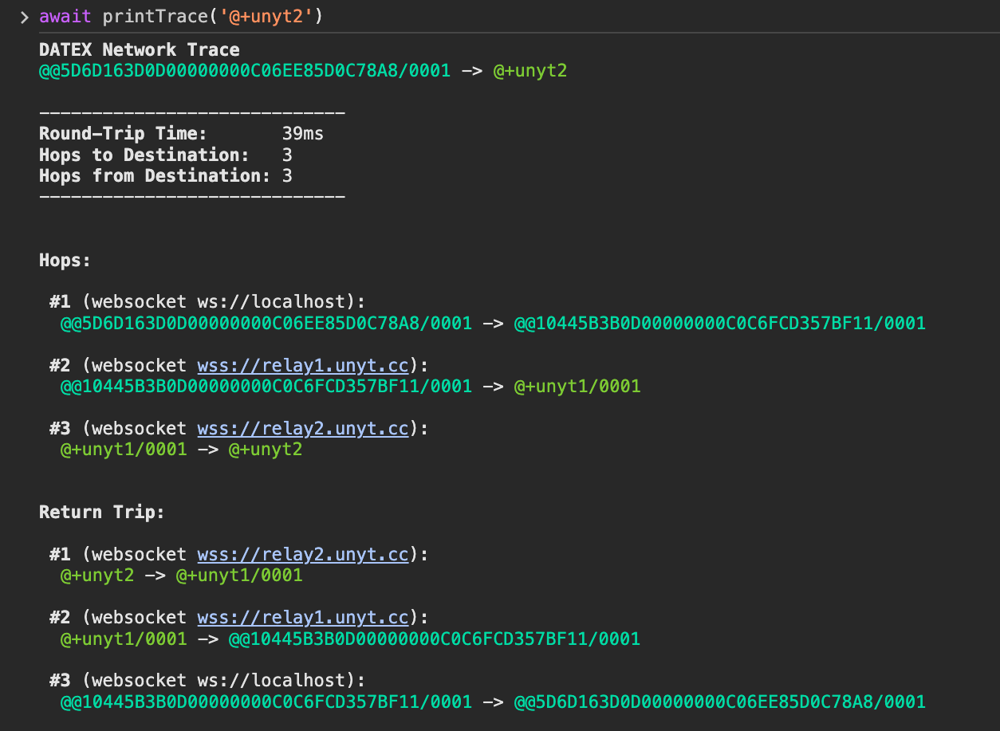

# Supranet Networking

## Connecting to the Supranet

When the DATEX JS library is initialized, an anonymous endpoint is automatically created.
To connect to the network, call:
```ts
await Datex.Supranet.connect()
```
Per default, the endpoint joins the Supranet by connecting to a unyt.org relay endpoint with a websocket connection.
You can always add custom connection channels and also connect over multiple channels like WebRTC at the same time.

## Temporary connections

You can also create a temporary connection with a new anonymous endpoint that is only valid for the current session.
```ts
await Datex.Supranet.connectTemporary()
```


## Debugging

### Network traces

The `printTrace` function can be used  to create a network trace report for debugging purposes.
`printTrace` also collects and shows additional relevant data like round-trip time and endpoint interface types.
To create a network trace, DATEX `TRACE` and `TRACE_BACK` messages are routed through the network to the destination endpoint and back.



The raw trace output can be retrieved by calling the `.trace()` method on an endpoint:

```ts
const trace = await f('@+unyt2').trace()
```

## Creating custom DATEX channels with the ComInterface

[TODO]
