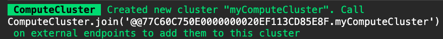

# Threads

The DATEX JS Library supports local multi-threading with [Web Workers](https://developer.mozilla.org/en-US/docs/Web/API/Web_Workers_API) as well as distributed multi-threading with [DATEX Compute Clusters](#compute-clusters).

DATEX-compatible values like functions or complex objects can also be shared between threads.
The library provides a way to use threads in a type-safe way.

## Module-level threads

The following example demonstrates the creation of a new thread from a module with exports that can be accessed
from the parent thread.

```ts
/// file: thread.ts
export function exportedFunction(x: number, y: number) {
  return x + y
}
export const exportedValue = $$([1,2,3]);
```

```ts
/// file: main.ts
import { spawnThread } from "datex-core-legacy/threads/threads.ts";

// spawn a new thread and load the 'thread.ts' module
using thread = await spawnThread<typeof import('./thread.ts')>('./thread.ts');
// access exported values:
const res = await thread.exportedFunction(1,2);
thread.exportedValue.push(4);
```

### Thread disposal

When a new thread is created with the `using` specifier, it is automatically disposed on scope exit.
Alternatively, you can explicitly dispose a thread with the `disposeThread` function:

```ts
import { spawnThread, disposeThread } from "datex-core-legacy/threads/threads.ts";

// spawn a new thread and load the 'thread.ts' module
const thread = await spawnThread<typeof import('./thread.ts')>('./thread.ts');
// do some stuff with this thread
disposeThread(thread)
// thread is no longer accessible
```


## Task threads

### Running task threads

Instead of declaring a thread module in a separate file, a task function can be passed to `run` to be executed in a new thread immediately.
Values from the parent scope can be passed to the thread by explicitly adding them to the `use()` declaration at the beginning of the function body.

> [!NOTE]
> When you are using transferable functions within a [UIX](https://docs.unyt.org/manual/uix) project, dependencies from the parent scope are automatically detected and transferred.
> You don't need to explicitly declare them with `use()`.

In the following example, a function calculates the nth fibonacci number in a thread.
The `n` index variable is accessed from the parent scope.

```ts
import { run } from "datex-core-legacy/threads/threads.ts";

let n = 10000n;

// calculate fibonacci number in a separate thread
let fibonacciNumber = await run(() => {
  use (n);

  let n1 = 0n;
  let n2 = 1n;
  let nextTerm = 0n;

  for (let i = 0; i < n; i++) {
      console.log(n1);
      nextTerm = n1 + n2;
      n1 = n2;
      n2 = nextTerm;
  }
  return n1;
});
```


### Running multiple concurrent tasks

With the `runConcurrent` functions, multiple threads can be spawned to run a task concurrently.
Per default, `runConcurrent` returns an array of Promises containing the results of all the threads.

```ts
import { runConcurrent } from "datex-core-legacy/threads/threads.ts";

// spawn 10 threads to find a random number >= 0.999
// 'results' is an Array<Promise<number>>
let results = await runConcurrent(() => {
  let value = 0
  while (value < 0.999) {
    value = Math.random();
  }
  return value;
}, 10);
```

Optionally, a Promise mapping function (e.g. `Promise.all`) can be passed to `runConcurrent` to return a mapped result:

```ts
import { runConcurrent } from "datex-core-legacy/threads/threads.ts";

// spawn 10 threads to find a random number >= 0.999
// and stop if one thread is finished
// 'result' is a number
let result = await runConcurrent(() => {
  let value = 0;
  while (value < 0.999) {
    value = Math.random();
  }
  return value;
}, 10, Promise.any);
```

```ts
const sharedSet = $$ (new Set());

const results = await runConcurrent(
  // i is the index of the current task
  i => {
    use (sharedSet);
    sharedSet.add(i);
    return i;
  }, 
  // spawn 10 threads
  10, 
  // collapse the returned values with Promise.all
  Promise.all
)

console.log(results) // [0,1,2,3,4,5,6,7,8,9]
console.log(sharedSet) // Set {0,1,2,3,4,5,6,7,8,9} (not necessarily in this order)
```


### Compute Clusters

The DATEX threading library also provides a straightforward way for running concurrent threads distributed
over multiple endpoints in the Supranet using **Endpoint Compute Clusters**.

Per default, all threads spawned with `run` and `runConcurrent` are running in local worker threads.
When the `cluster` property is set in the thread configuration, threads are executed on remote endpoints
participating in the specified compute cluster.

```ts
import { ComputeCluster } from "datex-core-legacy/threads/compute-clusters.ts";
import { configure } from "datex-core-legacy/threads/threads.ts";

// create a new compute cluster
const myComputeCluster = ComputeCluster.create("myComputeCluster");

// use the cluster for threading
configure({ cluster: myComputeCluster })
```

You will see a log output like this in the console when the compute cluster was sucessfully created:


When a task is now executed, it is still executed in a local thread as long as no endpoints have joined
the compute cluster.

An endpoint can be added to the cluster by calling 
```ts
ComputeCluster.join('@@77C60C750E0000000020EF113CD85E8F.myComputeCluster')
```
(using your own identifier from the log) on the endpoint itself.

Tasks are now equally distributed among all available endpoints in the cluster.


<!-- > [!NOTE]
> Passing `Promise.any` to `runConcurrent` produces the same outcome as calling 
> `Promise.any` on the result returned from `runConcurrent`.
> 
> However, there is a significant performance improvement when passing `Promise.any` as a 
> parameter to `runConcurrent`: When one of the threads returns a result, 
> all other threads are automatically prematurely terminated, instead of continuing until they are
> finished.  -->

### Logging

The `console` object from the parent context can be accessed with a `use()` declaration like any other value inside a task function:

```ts
await runConcurrent(i => {
  use (console);
  console.log(`Hello from Task ${i}`)
}, 5);
```

Keep in mind that outputs to the console are only printed after a blocking (non-async) task is completed.
In the following example, the console.log outputs are only shown after both blocking `sleep()` calls are finished:

```ts
await run(async i => {
      use (console);

      function sleep() {
        while (Math.random() > 0.000000005) {}
      }
    
      console.warn(`task checkpoint #1`);
      sleep();
      console.warn(`task checkpoint #2`);
      sleep();
});
console.log("task finished")

// logs:
// "task finished"
// "task checkpoint #1"
// "task checkpoint #2"
```

When using async (non-blocking) code, the logs are printed immediately and in the expected order:
```ts
await run(async i => {
      use (console);
    
      console.warn(`task checkpoint #1`);
      await sleep(1000);
      console.warn(`task checkpoint #2`);
      await sleep(1000);
});
console.log("task finished")

// logs:
// "task checkpoint #1"
// "task checkpoint #2"
// "task finished"
```


### Executing DATEX Script

The `run` function can also be used to run a DATEX Script in a separate thread:

```ts
import { run } from "datex-core-legacy/threads/threads.ts";

let n = 10000n;

// calculate fibonacci number in a separate thread
let fibonacciNumber = await run `
  val n1 = 0;
  val n2 = 1;
  val nextTerm = 0;
  val i = 0;

  iterate (i..${n}) (
    print n1;
    nextTerm = n1 + n2;
    n1 = n2;
    n2 = nextTerm;
  );
  n1;
`
```

Values from the parent scope can be injected in template string as with the [`datex` function](./5%20The%20DATEX%20API.md#the-datex-template-function)


### Configuration

The behaviour for task threads spawned with `run` or `runConcurrent` can be configured
with the `configure` function:

```ts
import { configure } from "datex-core-legacy/threads/threads.ts";

configure({
  /**
   * Maximum number of threads that can run tasks concurrently
   * Module threads are excluded from this limit
   * Default: Infinity
   */
  maxConcurrentThreads: number,
  /**
   * Minimum lifetime of an idle thread in seconds
   * Default: 60
   */
  minIdleThreadLifetime: number,
  /**
   * Cluster used for remote execution
   */
  cluster?: ComputeCluster
})
```

The default configuration works fine for most use cases. 

When you are running hundreds of small tasks in parallel, it might be more
efficient to limit the maximum number of concurrent threads (`maxConcurrentThreads`) to improve performance.

The `minIdleThreadLifetime` can be increased or set to `Infinity` if you are continually spawning new tasks because
it is more efficient to reuse idle threads instead of spawning new ones.