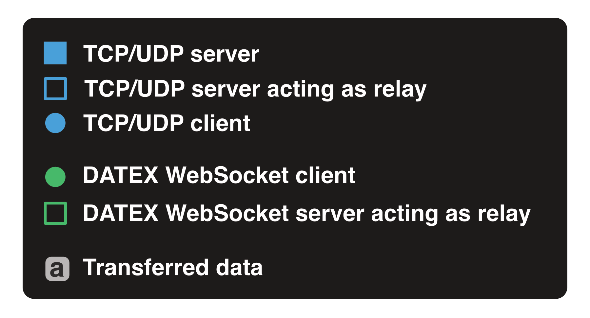
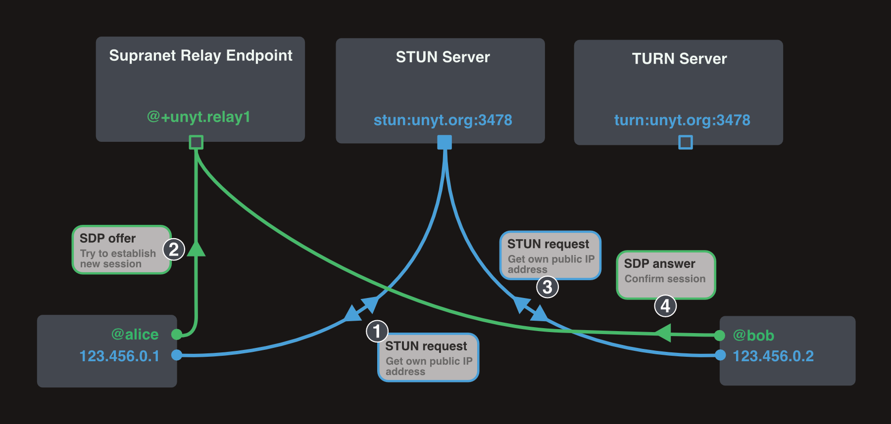
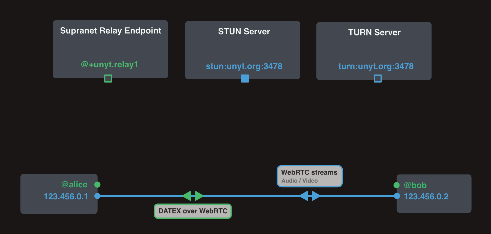
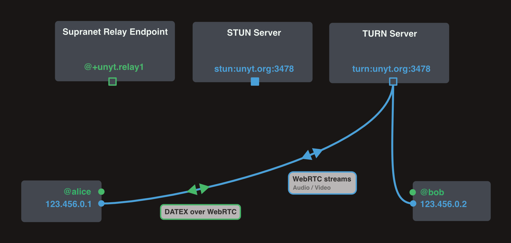

# Communication Interfaces

DATEX communication is not restricted to a specific underlying communication channel.
DATEX blocks can be transmitted via WebSockets, TCP, WebRTC, HTTP or with Channel Messaging between browser workers or windows.
The DATEX JS Library provides a `CommunicationInterface` API which allows the implementation of other custom communication channels.

## Connecting communication interfaces

When calling `Supranet.connect()`, the DATEX Runtime automatically creates a connection with a communication interface.
Per default, WebSocket communication interfaces for public unyt.org relay endpoints (https://unyt.cc/nodes.dx) are used.

To establish a connection over another communiction channel, you need to create a new instance of the corresponding `CommunicationInterface` and add it to the `communicationHub`:

```ts
import { WebSocketClientInterface } from "datex-core-legacy/network/communication-interfaces/websocket-client-interface.ts";
import { communicationHub } from "datex-core-legacy/network/communication-hub.ts";

// create a new WebSocketClientInterface connected to wss://example.com
const webSocketInterface = new WebSocketClientInterface("wss://example.com");

// add the interface to the communication hub
const connected = await communicationHub.addInterface(webSocketInterface)

// true if connection could be establised:
console.log("connected:", connected);
```

The interface constructor signature can be different for other communication interfaces, but everything else works the same way.

## Builtin commmunication interfaces

### WebSocket
-
### HTTP
-
### Worker
-
### Window
-
### WebRTC

#### Legend


#### Establishing a WebRTC connection

To establish a [WebRTC](https://webrtc.org/) connection between two endpoints, each endpoint first gets its own public IP address from a STUN Server (Step 1 and 3).

The two endpoints then negotiate a session by exchanging SDP offers and answers (Step 2 and 4). The DATEX WebRTC communication interface does not require an explicit [signaling server](https://developer.mozilla.org/en-US/docs/Web/API/WebRTC_API/Signaling_and_video_calling#the_signaling_server). Instead, SDP negotation happens directly between the two endpoints via DATEX (this might require a relay endpoint, which could be regarded as a kind of signaling server).



The negotiated session can either use a direct or an indirect connection via a [TURN server](https://webrtc.org/getting-started/turn-server).

#### Direct WebRTC connection

If the two clients are in the same network or if [NAT traversal](https://en.wikipedia.org/wiki/NAT_traversal) is possible using public ip addresses of the two clients,
a direct connection can be established:




#### Indirect WebRTC connection

As a fallback, WebRTC connections are relayed using a public TURN server.




#### WebRTC data exchange

Once a connection is established, it can be used to transmit video or audio streams, as well as DATEX blocks using a [data channel](https://developer.mozilla.org/en-US/docs/Web/API/RTCDataChannel).
`MediaStream` tracks are transmitted directly via WebRTC, any other data is transmitted via the DATEX data channel.

## Implementing custom communication interfaces

-